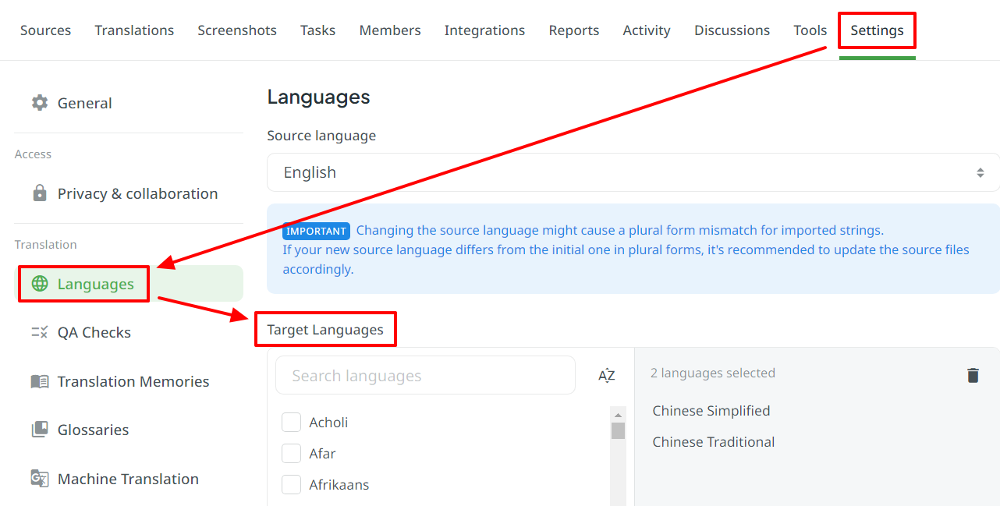

<h1 id="maintaining-guidelines">
Maintaining Guidelines
</h1>

[Back to README](../README.md)

<details><summary><strong>Switch Languages</strong></summary>
<p></p>
<ul>
  <li><a href="./MAINTAINING.md"><code>en</code> : English</a></li>
  <li><a href="./MAINTAINING.zh_TW.md"><code>zh_TW</code> : 繁體中文</a></li>
</ul>
</details>

<h2 id="table-of-contents">
Table of Contents
</h2>

<ul>
  <li><a href="#adding-a-new-language">Adding a New Language</a></li>
  <li><a href="#adding-a-new-version">Adding a New Version</a></li>
  <li><a href="#updating-the-latest-version">Updating the Latest Version</a></li>
  <!-- <li><a href="#deal-with-prs-created-by-github-actions">Deal with PRs created by GitHub Actions</a></li> -->
</ul>

<h2 id="adding-a-new-language"><a href="#table-of-contents">
Adding a New Language
</a></h2>

When a new language request is created, maintainers should follow the steps below:

1. Go to Crowdin Project -> Settings -> Languages, and then choose the target lanugage to add.

   

2. Make sure accomplishing the following modifications in the Pull Request:

   - Add a new language mapping in the following files:

     - <a href="../cmake/templates/crowdin.yml.in"><code>cmake/templates/crowdin.yml.in</code></a> (Crowdin -> Sphinx)
     - <a href="../crowdin.yml"><code>crowdin.yml</code></a> (Crowdin -> Sphinx)
     - <a href="../languages.json"><code>languages.json</code></a> (Sphinx -> Crowdin)

   - Add a new language preset in <a href="../CMakePresets.json"><code>CMakePresets.json</code></a>.

   - Add a new language option to version switchers in the following documentation:

     - <a href="../docs/ACKNOWLEDGEMENTS.md"><code>docs/ACKNOWLEDGEMENTS.md</code></a>
     - <a href="../docs/CONTRIBUTING.md"><code>docs/CONTRIBUTING.md</code></a>
     - <a href="../docs/MAINTAINING.md"><code>docs/MAINTAINING.md</code></a>
     - <a href="../README.md"><code>README.md</code></a>

   - Add information for the new language in <a href="../README.md"><code>README.md</code></a>, including:

     - <a href="../README.md#progress-of-translations">Progress of Translations</a>
     - <a href="../README.md#preview-in-gh-pages">Preview in GitHub Pages</a>

3. Run the following command after <code>languages.json</code> is updated:

   ```
   cmake -P configure.cmake
   ```

4. Write the commit message and the pull request in the following form:

   ```
   chore(lang): add a new language 'zh_CN'
   ```

<h2 id="adding-a-new-version"><a href="#table-of-contents">
Adding a New Version
</a></h2>

When a new version is required, maintainers should follow the steps below:

1. Make sure accomplishing the following modifications in the Pull Request:

   - Add a new version in the following files:

     - <a href="../configure.cmake"><code>configure.cmake</code></a>
     - <a href="../cmake/templates/version_switch.js.in"><code>cmake/templates/version_switch.js.in</code></a>
     - <a href="../.github/workflows/matrix.json"><code>.github/workflows/matrix.json</code></a>

2. Write the commit message and the pull request in the following form:

   ```
   feat(ver): add a new version 'v3.28'
   ```

<h2 id="updating-the-latest-version"><a href="#table-of-contents">
Updating the Latest Version
</a></h2>

When the latest version is updated, maintainers should follow the steps below:

1. Make sure accomplishing the following modifications in the Pull Request:

   - Modify the contents of <a href="../.latest-version.txt"><code>.latest-version.txt</code></a>

2. Write the commit message and the pull request in the following form:

   ```
   feat(ver): update the latest version to 'v3.28'
   ```

<!-- <h2 id="deal-with-prs-created-by-github-actions"><a href="#table-of-contents">
Deal with PRs created by GitHub Actions
</a></h2>

Generally, maintainers simply need to deal with PRs created by <a href="../.github/workflows/ci-sphinx-update-pot.yml"><code>ci-sphinx-update-pot</code></a>, regularly.

If it's not up-to-date, make sure to select **"Update with rebase"** to update.


When there are too many PRs triggering the <code>ci-crowdin-upload-pot</code> to upload pot files, the following error may showed up:

```
❌ Error from server: <Code: <empty_code>, Message: Unexpected character ('<' (code 60)): expected a valid value (JSON String, Number, Array, Object or token 'null', 'true' or 'false')
 at [Source: (String)"<html>
<head><title>429 Too Many Requests</title></head>
<body>
<center><h1>429 Too Many Requests</h1></center>
<hr><center>nginx</center>
</body>
</html>
"; line: 1, column: 2]>
```

To solve this error, you just need to click "Rerun failed jobs". -->
